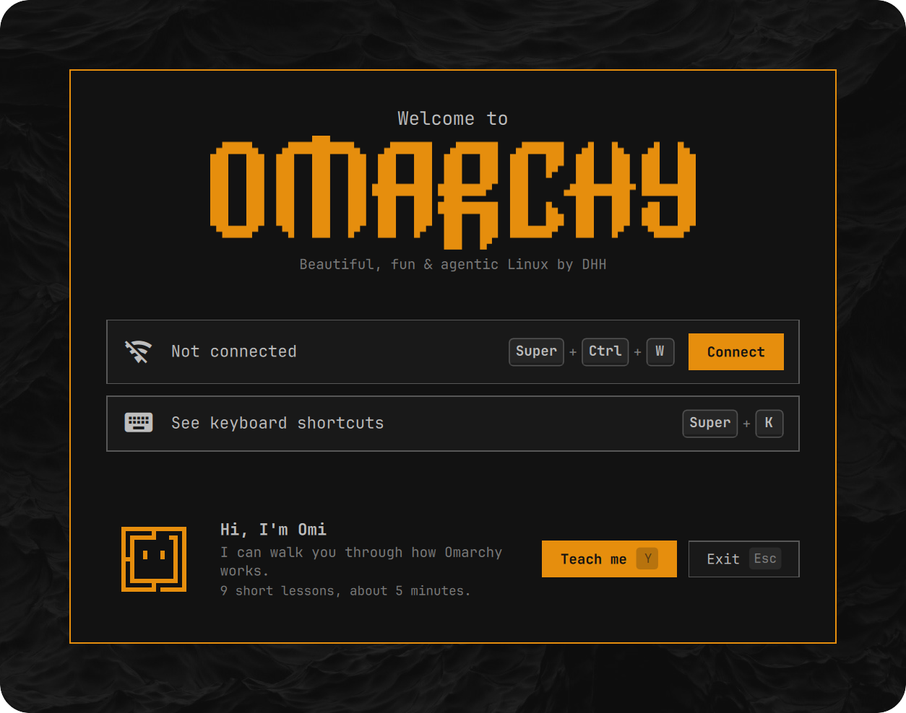
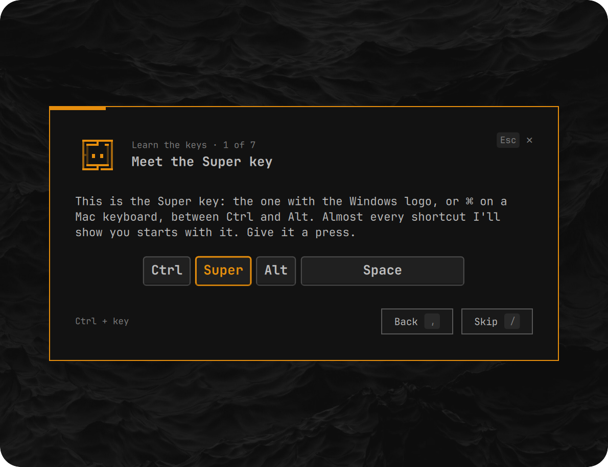
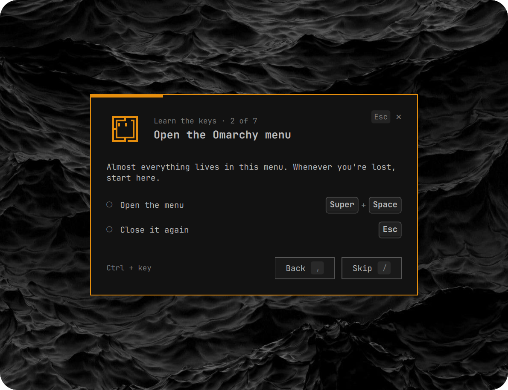
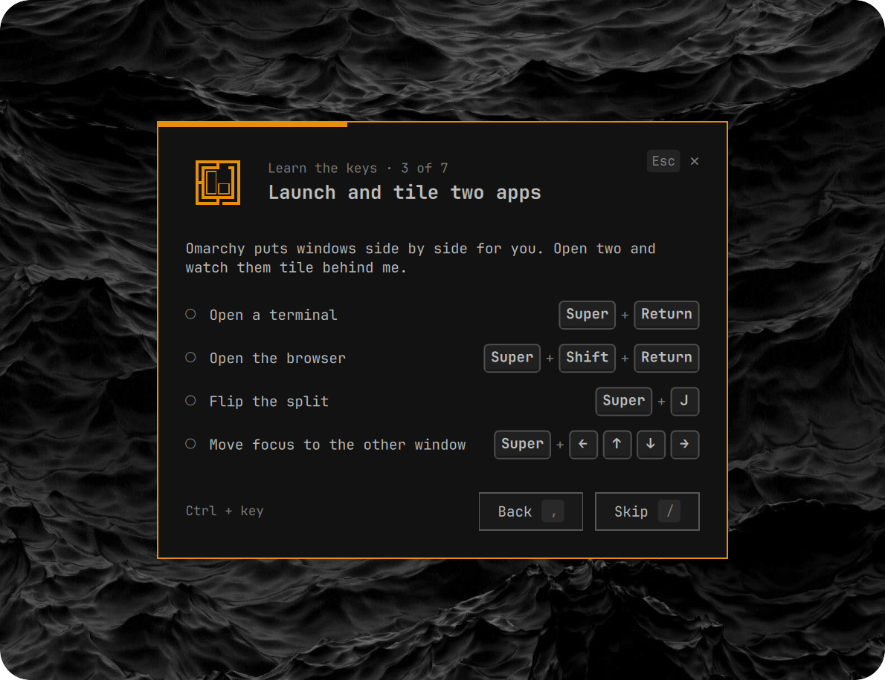
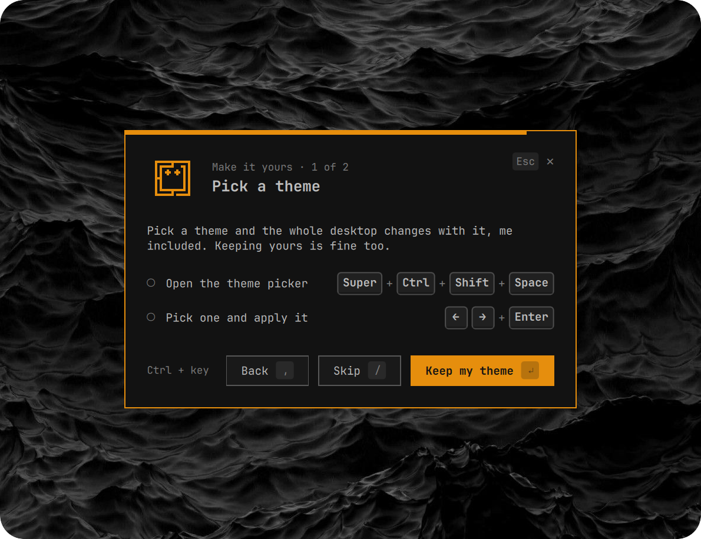
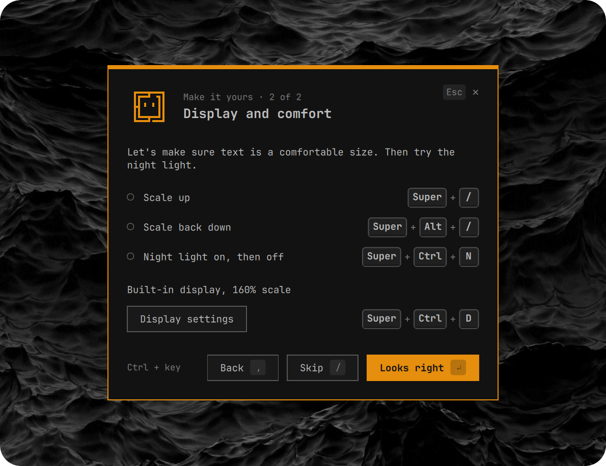
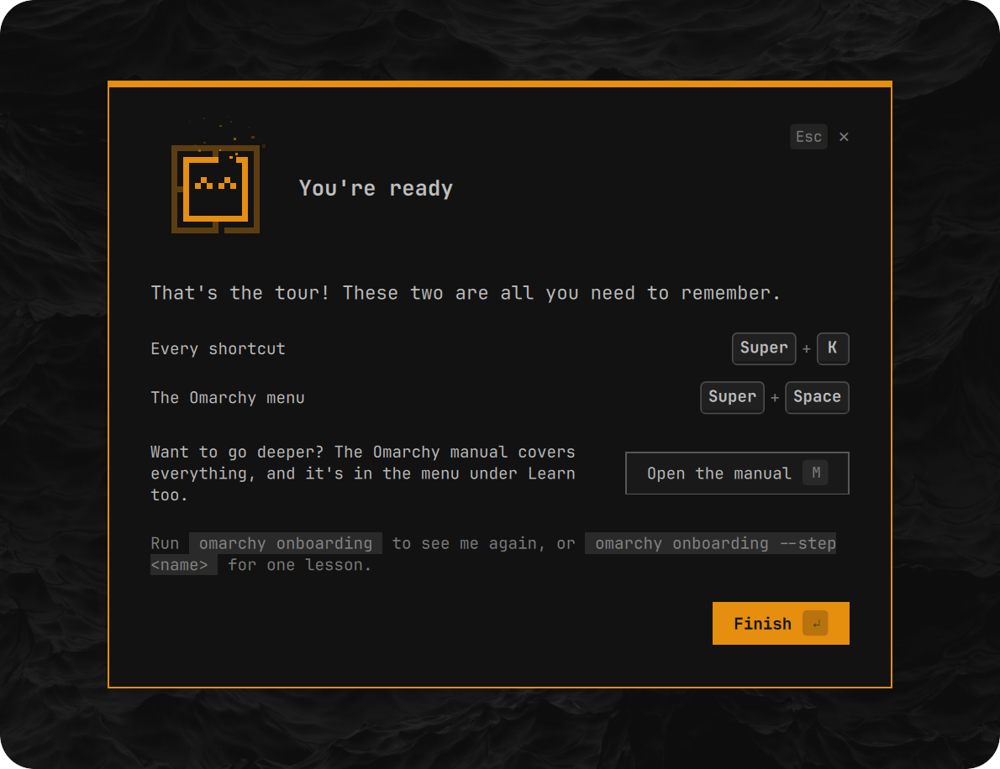

# Omarchy onboarding

First-boot onboarding for [Omarchy](https://omarchy.org), built as an Omarchy shell plugin (`tahayvr.onboarding`). A welcome checklist gets you online and up to date and shows where every shortcut lives; an optional tutorial then teaches the keys by having you press them, while an overlay watches Hyprland and ticks each step off as you do it.

<p align="center">
  
</p>

The tutorial's lessons sit in a corner card, so the shortcuts reach Hyprland while you practise them. Each sub-task ticks off as you press its keys.

<p align="center">
  
  
</p>
<p align="center">
  
  
</p>
<p align="center">
  
  
</p>

Work in progress. The welcome checklist (Wi-Fi, Omarchy update, keybindings) and the tutorial (Super key, menu, tiling, window controls, workspaces, clipboard, Super + K, theme, display) work end to end. `omarchy-onboarding install` adds the login line that starts it on first login; that path is tested by hand on a new machine. See `AGENTS.md` for the contracts with Omarchy and Hyprland and the traps found along the way.

## Install for development

```bash
ln -s ~/dev/omarchy-onboarding ~/.config/omarchy/plugins/tahayvr.onboarding
omarchy-shell shell rescanPlugins
omarchy-shell shell setPluginEnabled tahayvr.onboarding true
```

The shell doesn't see edits through the symlink and can't hot-swap a plugin in use, so run `scripts/reload-shell.sh` after changing QML. Logic in `lib/` is tested with node and needs no reload.

## Use

```bash
bin/omarchy-onboarding                     # start or resume
bin/omarchy-onboarding --step theme        # replay one lesson
bin/omarchy-onboarding status              # where the flow is
bin/omarchy-onboarding steps               # step names
```

While developing, always pass `--state /tmp/onboarding-test.json` (or set `OMARCHY_ONBOARDING_STATE`) so the real state in `~/.local/state/omarchy/onboarding.json` is never touched. A test state also turns on `--dry-run`: the Omarchy update is logged instead of run, unless you add `--live`. With the overlay open, `tutorial`, `close-welcome`, `connect`, `update`, `keys`, `come-back` (the checklist's "come back" card), `previous` (the card's Back), `redo` (the finish screen's Do them now), `next`, `skip`, `dismiss`, `do-it` and `info` drive the flow by hand. `--facts '{"online":false}'` or `--facts '{"update":"available"}'` shows the checklist's other states.

## Test

```bash
node tests/run.js              # engine, drills and recorded walkthroughs; no display needed
scripts/drive-drills.sh        # live: the whole tutorial through the real plugin
```

`drive-drills.sh` uses empty workspaces 7 and 8. It only acts on windows it opened, and it refuses to run while the screen is locked. It walks every drill, Back, and Do them now from the finish screen, through to completion, in about 35 seconds. Pass a path to save the walkthrough as a new fixture; `tests/fixtures/walkthrough-flow.jsonl` is one, and the tests replay its flow changes through the engine.

## Omi

`omi/` is Omi, the Omarchy mascot, from [Meet Omi](https://github.com/tahayvr/meet-omi). Don't edit it here. To update it, run `scripts/sync-omi.sh` (the latest on master) or `scripts/sync-omi.sh <tag or full commit>`, then commit `omi/`. It fetches from GitHub, checks the player against the pack's conformance data, and records the commit in `omi/SOURCE`. It needs `git`, `node` and `jq`.

## Upstream

Onboarding is built to ship with Omarchy. Until it does, `omarchy-onboarding install` adds its login line to your own `autostart.lua`, so Omarchy's first-run welcome and Wi-Fi/update notices still appear alongside it on first login.

Shipping it upstream means two changes to Omarchy:

- `default/hypr/autostart.lua` runs `omarchy-onboarding login` at every login, when it's installed. It decides whether to start, resume an unfinished run, or do nothing: after the first run, onboarding only comes back when you run `omarchy onboarding`.
- `bin/omarchy-provision-first-run` skips the welcome and Wi-Fi/update notices (`welcome.sh` and `wifi.sh`) when onboarding is installed, since its welcome page gets the user online and offers the update. Everything else in first-run stays, including the agent-setup hook, which onboarding doesn't cover.
